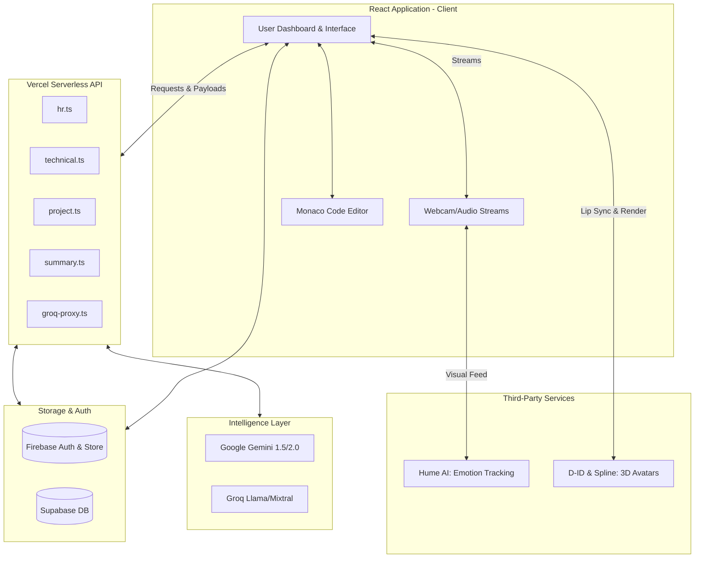

# 🧠 NERV AI Interview System 

     

---

## 🌟 Overview

**NERV** is a next-generation, serverless AI-powered technical interviewing platform designed to simulate hyper-realistic, multi-round job interviews. Beyond simple Q&A bots, NERV integrates **real-time facial emotion recognition**, **lifelike 3D avatars**, and **advanced Generative AI pipelines** to evaluate candidates holistically. 

NERV automatically tailors its technical assessments directly from the user's uploaded resume and dynamically shifts question difficulty based on the candidate's emotional state and technical performance. After completing the interview rounds, NERV generates an advanced analytics dashboard mapping strengths, weaknesses, code logic skills, and emotional stability throughout the process.

---

## 📐 Core System Architecture

NERV operates on a fully serverless, highly scalable micro-architecture utilizing Vercel's Edge and Serverless runtimes. This guarantees minimal latency during computationally heavy inference tasks.



### Flow Summary
1. **Client Layer:** The user interfaces with a highly responsive React/Vite application. The browser captures webcam video and microphone audio.
2. **Real-time Processing:** Video frames are analyzed by **Hume AI** (and Azure Cognitive Services Face API) to derive emotional metrics (e.g., anxiety, confidence). Audio is processed for intent and context.
3. **Action Routing:** The frontend routes specific interview stage data to respective Vercel Serverless `/api` endpoints (HR, Technical, Project rounds).
4. **LLM Synthesis:** The active endpoint communicates with Google Gemini and Groq, feeding it the user's previous answer, the context of the resume, and the current emotional telemetry. The LLM generates the *exact next question* and feedback.
5. **Avatar Response:** The generated text is streamed to the **D-ID** SDK or **Spline** models, which synthesize lifelike lip-synced audio and video responses back to the candidate natively in the browser.

---

## 🚀 Detailed Feature Breakdown

### 1. Next-Generation Interactivity (Virtual Avatars)
NERV removes the sterile "chat interface" experience by integrating photorealistic avatars via the **D-ID Client SDK** and interactive 3D models via **Spline**. Avatars don't just speak; they blink, nod, and have natural resting micro-movements, providing candidates with realistic social pressure and interaction cues identical to human interviewers.

### 2. Real-Time Emotion & Expression Engine
Hume AI continuously analyzes the candidate's facial micro-expressions. 
- **Adaptive Empathy:** If the platform detects high stress or anxiety, the backend prompts the LLM to adopt a more encouraging tone or ask a slightly easier "confidence-building" question.
- **Engagement Tracking:** Measures eye contact and focus, impacting the final "soft skills" score in the post-interview summary.

### 3. Adaptive Interview Logic (Multi-Round)
The system isn't deterministic; it behaves differently for every user.
- **HR Round (`api/hr.ts`):** Evaluates teamwork, leadership, conflict resolution, and cultural fit.
- **Project Round (`api/project.ts`):** Parses the resume and asks hyper-specific questions about reported historical projects ("I see you used Kafka at Company X, how did you handle partitioned message ordering?").
- **Technical Round (`api/technical.ts`):** Uses **Monaco Editor** for live code execution and asks algorithmic or system design questions based strictly on the user's stated tech stack.

### 4. RAG & Dynamic Knowledge Graphs
To ensure the LLM understands specialized or localized technologies, NERV incorporates a local vector-chunking pipeline using `pdfjs-dist` and IndexedDB (`idb`). NERV converts training PDFs or technical docs into dense vector embeddings. During an interview, the LLM utilizes Retrieval-Augmented Generation (RAG) to cross-reference the candidate's answers against the parsed knowledge graph for absolute accuracy.

### 5. Deep Analytics & Performance Dashboard
Following the interview, NERV hits `api/summary.ts` to aggregate all round data, feeding it to **Chart.js** and **Vis-Network**. The dashboard exposes:
- **Radar Charts:** Coding, System Design, Communication, Framework Knowledge.
- **Line Graphs:** Emotional state mapped over time against specific questions.
- **Node Graphs:** Concept map of technologies the candidate thoroughly understood vs. topics they struggled heavily with.

---

## 🛠 Technology Stack Deep Dive

| Layer | Technology | Purpose / Reasoning |
|---|---|---|
| **Frontend Core** | React 18, TypeScript, Vite | Blazing fast HMR, type safety, component-driven UI. |
| **Routing** | React Router v6 | Client-side routing with seamless page transitions without reloading video buffers. |
| **Styling** | Tailwind CSS, Framer Motion | Utility-first styling for rapid prototyping with highly complex, liquid micro-animations via Framer Motion. |
| **Data Viz** | Chart.js, Vis Network | Rendering complex post-interview emotional mapping and knowledge node graphs. |
| **Avatars** | D-ID, Spline | Live TTS to lip-sync synthesis for 2D/3D human simulation. |
| **Code Editor** | Monaco-editor/react | VSCode-like environment inside the browser for the Technical Round. |
| **Backend Layer** | Vercel Serverless Functions | Highly scalable edge computing eliminating cold start issues for critical path APIs. |
| **AI Models** | Google Gemini 1.5, Groq | Gemini for deep context reasoning; Groq for ultra-low latency response generation. |
| **Emotion API** | Hume AI, Azure Face | Real-time sentiment and micro-expression telemetry directly from the webcam feed. |
| **Storage & Auth** | Firebase, Supabase | Firebase for instantaneous Auth and NoSQL syncing; Supabase for structured relational analytics storage. |

---

## 📂 Repository Structure

```text
nerv-interview-platform/
├── api/                     # Vercel Serverless Endpoints
│   ├── hr.ts                # Logic for behavioral / HR interview stage
│   ├── technical.ts         # Coding / algorithmic assessment logic
│   ├── project.ts           # Resume / Deep-dive project questioning
│   ├── summary.ts           # Post-interview evaluation amalgamation
│   └── groq-proxy.ts        # Proxy to securely route Groq SDK calls
├── public/                  # Static assets (favicons, base models)
├── src/
│   ├── components/          # Reusable UI (Avatars, Graphs, Video Feeds)
│   ├── contexts/            # React Contexts (Auth, Emotion State, Theme)
│   ├── db/                  # Core DB initialization and wrappers
│   ├── lib/                 # Utility functions (RAG logic, Chunking, API wrappers)
│   ├── models/              # TypeScript Interfaces & Types
│   ├── pages/               # View Controllers (Dashboard, TechnicalRound, Results)
│   ├── services/            # Abstractions for D-ID, Hume, Firebase
│   ├── App.tsx              # Router Map
│   ├── main.tsx             # React DOM bindings
│   └── index.css            # Tailwind directives & global CSS
├── eslint.config.js         # Linter rules
├── tailwind.config.js       # Design system tokens
├── tsconfig.json            # Strict TypeScript configuration
├── package.json             # NPM dependencies
├── vercel.json              # Serverless build paths, CORS, and routing rules
└── README.md                # System documentation
```

---

## ⚙️ Environment Variables & Secrets

Because NERV communicates heavily with multiple proprietary services, setting up your environment is crucial for both local development and Vercel hosting. 

Create a `.env` file at the root. Wait on committing this file; ensure it's in `.gitignore`.

```env
# Frontend Features / DB (Public safe keys)
VITE_FIREBASE_API_KEY=your_firebase_api_key
VITE_FIREBASE_AUTH_DOMAIN=your_firebase_auth_domain
VITE_FIREBASE_PROJECT_ID=your_firebase_project_id
VITE_SUPABASE_URL=your_supabase_url
VITE_SUPABASE_ANON_KEY=your_supabase_anon_key

# Backend & AI API Keys (Kept strictly on Vercel Node Runtime)
GEMINI_API_KEY=your_google_gemini_api_key
HUME_API_KEY=your_hume_api_key
D_ID_API_KEY=your_did_api_key
GROQ_API_KEY=your_groq_api_key
AZURE_COGNITIVE_KEY=your_azure_key
```

> [!WARNING]
> Never expose non-`VITE_` prefixed variables on the client frontend. They give root API access and will result in compromised billing accounts.

---

## 💻 Complete Setup Guide

### Prerequisites
- Node.js `20.x` or later.
- NPM or Yarn.
- Accounts on Firebase, D-ID, and Hume AI.

### Installation Steps
1. **Clone the repository:**
   ```bash
   git clone https://github.com/yourusername/nerv-interview-platform.git
   cd nerv-interview-platform
   ```

2. **Install Node Packages:**
   ```bash
   npm install
   ```

3. **Database Configuration:**
   - **Firebase:** Open the Firebase Console, create a web project, enable Authentication (Email/Password & Google), and create a Firestore DB. Copy the config into your `.env`.
   - **Supabase (Optional):** If using relation analytics, run the SQL setup script (found in `/src/db/schema.sql` if applicable) to instance the results tables.

4. **Spin up Local Dev Environment:**
   Run Vite dev server. Note that serverless functions under `/api` are locally emulated but work best using Vercel CLI.
   ```bash
   npm run dev
   ```
   *Alternatively, to test API hooks strictly as they will appear in production:*
   ```bash
   npm i -g vercel
   vercel dev
   ```

---

## ☁️ Deployment on Vercel

NERV's architecture relies on Vercel's ability to host static logic geographically close to the user while managing edge API calls perfectly.

1. **Push to GitHub:** Commit your latest work.
2. **Import Project into Vercel:** Point Vercel to your Github Repository.
3. **Configure Environment:** Within Project Settings -> Environment Variables, carefully copy over all local `.env` keys. Note that Vercel automatically protects keys that do not have the `VITE_` prefix from reaching the client browser.
4. **Deploy:** Vercel will install dependencies based on `package.json`, parse `vercel.json` for routing `/api`, and spin up your production dashboard.

---

## 🗺 Roadmap & Future Enhancements

- [ ] **Multi-Participant Interviews:** Simulated panel interviews utilizing multiple Spline/D-ID avatars debating simultaneously.
- [ ] **Voice-to-Code:** Direct translation of vocal algorithmic planning to Monaco editor comments for better "think-out-loud" grading.
- [ ] **WebRTC Streaming enhancements:** Decrease D-ID latency by optimizing WebRTC fallback tunnels.
- [ ] **Custom Model Fine-tuning:** Offering enterprise users the ability to provide internal HR handbook documents directly to the vector database.

---

## 🤝 Contributing

We welcome pull requests! Since this involves heavy LLM integration, test your local API routes exhaustively before submitting branches.

1. Fork the Project.
2. Create your Feature Branch (`git checkout -b feature/NewAwesomeAI`).
3. Commit your Changes (`git commit -m 'Add specific RAG chunking layer'`).
4. Push to the Branch (`git push origin feature/NewAwesomeAI`).
5. Open a Pull Request detailing what new packages you added and why.

---

## 📄 License

This repository is distributed under the MIT License. See `LICENSE` for more information.