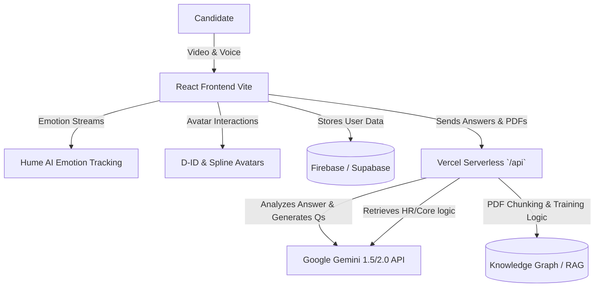

# NERV AI Interview System

    

## Overview

**NERV** is an advanced, AI-powered technical interview system designed to conduct realistic, multi-round job interviews. By leveraging real-time facial emotion recognition, lifelike avatars, and state-of-the-art Generative AI, NERV provides candidate-specific technical evaluations derived directly from their resume. After the interview, it provides comprehensive feedback, charting strengths, weaknesses, and emotional trends to help candidates improve.

## Architecture

At the core, NERV is powered by an entirely serverless micro-architecture deployed via Vercel.



## Features

- **Multi-Round Interviews**: Includes dedicated rounds for HR, Core, and Technical assessments, mimicking a real-world multi-stage tech interview.
- **Emotion & Expression Analysis**: Integrates **Hume AI** to analyze facial expressions in real-time, modifying the interviewer's demeanor or question difficulty if the candidate is extremely nervous or struggling.
- **Lifelike Virtual Avatars**: Uses **D-ID** APIs and **Spline** for interactive, responsive virtual interviewers that converse naturally.
- **Dynamic Question Generation**: Employs **Google Gemini** models to ingest candidate skillsets and actively generate the very next logical interview question, handling context gracefully.
- **Knowledge Graph & RAG Training**: Explores training materials by parsing PDF documents, systematically chunking the text (e.g., semantic chunks of 400 tokens with deliberate overlap), and encoding them into vector embeddings. This Retrieval-Augmented Generation (RAG) pipeline builds a robust knowledge graph, ensuring context-perfect and lightning-fast explanations during interactive candidate training sessions.
- **Detailed Results Dashboard**: Utilizes **Chart.js** to provide post-interview analytics, including performance graphs, strengths/weaknesses breakdowns, and emotional stability charts.
- **Resume-Driven Logic**: Customizes technical depth based strictly on the candidate's actual technology stack.

## Tech Stack

### Frontend Application
- **Framework**: React 18, TypeScript, Vite
- **Styling**: Tailwind CSS, Framer Motion
- **Routing**: React Router v6
- **Data Visualization & Graphs**: Chart.js, Vis Network

### Backend / Serverless APIs
- **Hosting / Routing**: Vercel Serverless Functions
- **LLM Integration**: `@google/generative-ai` (Gemini Models), `groq-sdk`
- **Emotion Engine**: Hume AI Platform
- **Avatar Engine**: D-ID Client SDK (`@d-id/client-sdk`)
- **Database & Auth**: Firebase / Supabase

## Usage Flow

1. **Sign Up / Login**: Securely authenticate to access the personalized dashboard.
2. **Setup Profile**: Supply the system with a resume, defining your technical stack and past project experience.
3. **Start Interview Session**:
   - The platform will initiate multi-round technical and HR screening.
   - The avatar asks the first question based on your skills.
4. **Answer Naturally**: Speak into the microphone. The system transcribes your speech, analyzes your facial expressions, and generates the next follow-up.
5. **Review Results**: Once the interview completes, navigate to the results dashboard to view a granular breakdown of your performance, complete with AI-generated feedback.

## Project Structure

```text
nerv-ai-interview/
├── api/                  # Vercel Serverless hooks (hr.ts, technical.ts, summary.ts)
├── public/               # Static web assets
├── src/
│   ├── components/       # Reusable React UI elements (Navbar, Avatars)
│   ├── contexts/         # State contexts for Auth and Theme
│   ├── pages/            # View Pages (Dashboard, TechnicalRound, Results, etc.)
│   ├── services/         # Third-party integrations (Hume, D-ID, Firebase)
│   ├── App.tsx           # React router definitions
│   └── main.tsx          # React DOM entry point
├── .env.example          # Template for environment variables
├── package.json          # Node dependencies & package scripts
├── vercel.json           # Vercel-specific build & routing config
└── README.md             # This document
```

## Environment Setup

NERV uses environment variables to communicate securely with third-party APIs.

1. Create a `.env` file in the root directory.
2. Configure it with your appropriate API Keys:

   ```env
   # Frontend Auth Defaults (Firebase)
   VITE_FIREBASE_API_KEY=your_firebase_api_key
   VITE_FIREBASE_AUTH_DOMAIN=your_firebase_auth_domain
   VITE_FIREBASE_PROJECT_ID=your_firebase_project_id

   # Backend / AI Keys (Kept secure within Vercel API Runtime)
   GEMINI_API_KEY=your_google_gemini_api_key
   HUME_API_KEY=your_hume_api_key
   D_ID_API_KEY=your_did_api_key
   GROQ_API_KEY=your_groq_api_key
   ```
   
> [!WARNING]
> Never commit the `.env` file to version control. Keep these keys strictly secure.

## Installation & Running Locally

1. **Clone the repository:**
   ```bash
   git clone https://github.com/yourusername/nerv-ai-interview.git
   cd nerv-ai-interview
   ```

2. **Install dependencies:**
   ```bash
   npm install
   # or
   yarn install
   ```

3. **Start the Vite development server:**
   ```bash
   npm run dev
   # or
   yarn dev
   ```

4. **Access the web app** in your browser at: `http://localhost:5173`

*(Note: Ensure your API paths fallback to localhost or use `vercel dev` if evaluating serverless routes locally).*

## Deployment

NERV is configured for seamless deployment to **Vercel**, taking advantage of the static frontend combined with Node.js Serverless Functions (`/api`).

1. Deploy your repository straight from GitHub to Vercel via the dashboard.
2. In the Vercel dashboard, add all the variables from your `.env` into **Environment Variables**.
3. Build and deploy. Vercel will automatically host the React app and map `/api/*` interactions to serverless routes according to `vercel.json`.

## Contributing

1. Fork the repository
2. Create your feature branch (`git checkout -b feature/amazing-feature`)
3. Commit your changes (`git commit -m 'Add some amazing feature'`)
4. Push to the branch (`git push origin feature/amazing-feature`)
5. Open a Pull Request

## License

This project is licensed under the MIT License - see the LICENSE file for details.