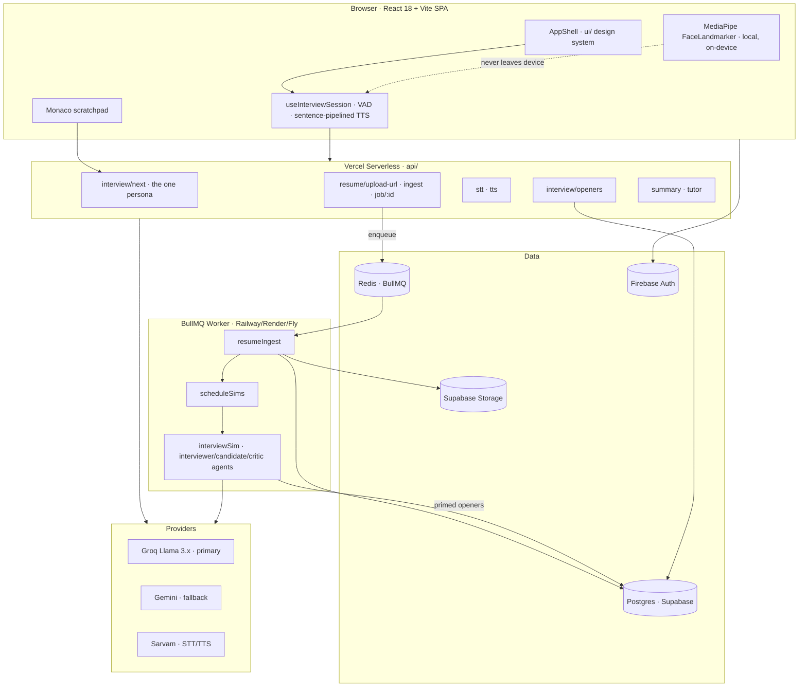

# NERV — AI Interview System

     

---

## Overview


**NERV** is a voice-first mock interview and screening platform. A candidate
uploads a resume; NERV reads it, then conducts a spoken, multi-round interview
whose every question is grounded in what that specific document actually says.
It listens for end-of-speech, can be interrupted mid-question, reads facial
expression locally in the browser, and produces an evidence-backed report.

The thing that makes it worth using is narrow and deliberate: **the questions
come from the resume, not from a question bank.** Everything else in the system
exists to make that fast, honest and cheap enough to run at scale.

---

## What it actually does

### Resume-grounded questioning

An uploaded PDF goes through a real ingestion pipeline on a background worker,
not a best-effort parse in a `useEffect`:

1. **Text layer first.** `pdf.js` pulls the embedded text. If the document has a
   usable text layer this is exact, instant and free.
2. **Vision only when it has to be.** If the text comes back too thin to trust —
   a scan, or an image-only export — the router falls through to a Groq vision
   model over rendered pages. Paying for a VLM on every upload would be a waste;
   never paying for one means silently failing on scanned resumes.
3. **Structure, then chunk.** The text is turned into typed skills / projects /
   experience / education / achievements. Long resumes are section-aware chunked
   rather than truncated at a character count, so the last job on a three-page CV
   is as visible to the interviewer as the first.

The interviewer is only ever handed that structure. It cannot ask about a
framework the candidate never listed.

### Three rounds, one engine

`technical`, `core` and `hr` are prompts and budgets, not codebases. A single
`useInterviewSession` hook runs the loop for all of them, and a single
`/api/interview/next` endpoint holds the persona. Difficulty and tone adapt on
blended answer quality and expression signal — adaptive, never hostile.

The technical round includes a **Monaco scratchpad**. It is a scratchpad by
design: nothing is executed server-side. Its contents are read as context by the
interviewer and the report, which is what a whiteboard is for in a real
interview.

### Voice, not a chat box

- **VAD endpointing** (Silero via `@ricky0123/vad-web`) detects end-of-speech, so
  the candidate never hunts for a Stop button.
- **Barge-in.** With echo cancellation available, the detector stays live through
  the interviewer's own audio and the candidate can cut in mid-question.
- **Sentence-pipelined TTS.** Synthesis starts on the first complete sentence
  while the model is still generating the rest, instead of after the full reply
  lands.
- **It always degrades.** No VAD means push-to-talk. No mic means a typed answer.
  Both are first-class, not error states.

### Expression capture that doesn't lie

Facial expression runs **locally, on the candidate's machine**, through MediaPipe
FaceLandmarker on WASM + GPU. No socket per candidate, no per-frame invoice, no
network round trip inside a latency-sensitive loop — and the webcam frames never
leave the device, which matters for a product that points a camera at people
while they are under pressure. Hume streaming is available as an opt-in for
higher accuracy.

**The honesty guarantee:** this system never fabricates, randomises, seeds or
floors an expression score. If no face is detected, if the model cannot load, if
the camera is off — the readout says *unavailable* and the report omits the
section. A confident-looking number with nothing behind it is worse than no
number, because someone will make a hiring decision with it.

### The interview that runs before yours

When a resume finishes ingesting, the worker interviews a **synthetic candidate**
with the production persona, against that same resume:

- **Priming** (3 model calls, always) writes the opening question for each round
  ahead of time. Question one is the turn a candidate waits through with nothing
  on screen, and it is the one turn that depends on nothing they have said — so
  it can be written in advance. `GET /api/interview/openers` reads it back, once,
  while they are still on the intro card. The first question costs zero model
  latency.
- **Auditing** (~34 calls, sampled at 5%) replays a complete three-round
  interview with one of four candidate personas and critiques every interviewer
  turn — too long, multi-question, off-round, ungrounded, hostile, repeated,
  ignored the answer. A prompt regression gets caught by us on a sample rather
  than by a real candidate mid-round.

Sampling is deterministic on the resume's content hash, so a retried enqueue
makes the same decision instead of re-rolling.

### The report

One report, `/nerv-summary`: executive summary, per-round breakdown, evidence
quotes pulled from the transcript, a knowledge graph of demonstrated strengths
versus gaps, and — only when expression data was genuinely captured — an emotion
timeline. Computed from the same numbers the live read used, so the report and
the interview cannot disagree.

---

## Architecture


```mermaid
flowchart TD
    subgraph Client [Browser · React 18 + Vite SPA]
        UI[AppShell · ui/ design system]
        Session[useInterviewSession · VAD · sentence-pipelined TTS]
        Face[MediaPipe FaceLandmarker · local, on-device]
        Mono[Monaco scratchpad]
    end

    subgraph API [Vercel Serverless · api/]
        Next[interview/next · the one persona]
        Openers[interview/openers]
        STT[stt · tts]
        Upload[resume/upload-url · ingest · job/:id]
        Sum[summary · tutor]
    end

    subgraph Worker [BullMQ Worker · Railway/Render/Fly]
        Ingest[resumeIngest]
        Sched[scheduleSims]
        Sim[interviewSim · interviewer/candidate/critic agents]
    end

    subgraph Infra [Data]
        Redis[(Redis · BullMQ)]
        PG[(Postgres · Supabase)]
        Store[(Supabase Storage)]
        FB[(Firebase Auth)]
    end

    subgraph Models [Providers]
        Groq[Groq Llama 3.x · primary]
        Gem[Gemini · fallback]
        Sarvam[Sarvam · STT/TTS]
    end

    UI --> Session --> API
    Face -.->|never leaves device| Session
    Mono --> Next
    Upload -->|enqueue| Redis --> Ingest --> Sched --> Sim
    Ingest --> PG
    Ingest --> Store
    Sim -->|primed openers| PG
    Openers --> PG
    API --> Models
    Sim --> Models
    Client --> FB
```

Two runtimes, for one reason: **a serverless function cannot hold a queue
subscription open**, and a 40-second vision parse cannot be done inside an HTTP
request the user is waiting on. So the API enqueues and the worker consumes.

The split of database access follows from the same logic. The API reaches
Postgres through **PostgREST** — serverless instances scale out faster than a
Postgres connection limit can absorb, and a few hundred concurrent uploads
holding sockets is the classic way to take a database down. The worker is a
fixed set of long-lived processes, so it uses `pg` directly through a pool, via
the **transaction pooler**.

### Built for concurrent load

| Concern | How it's handled |
| --- | --- |
| Duplicate work | Idempotency through a UNIQUE index, resolved inside `claim_*_job`. Never read-then-write — two pods racing the same upload produce one row. |
| Concurrent writes | Per-user `pg_advisory_xact_lock`, transaction-scoped so it releases at COMMIT/ROLLBACK. A SIGKILLed pod strands nothing. Resumes and sims use different lock namespaces so an audit can't block an upload. |
| Dead workers | Heartbeats plus `reap_stalled_jobs()` / `reap_stalled_sims()` every 60s, as the database-side backstop to BullMQ's own stalled detection. |
| Stranded rows | Every failure path ends in `failed`, which the claim functions can revive. `queued` — which they cannot revive — is never a terminal resting place, so an idempotency key can never become a tombstone. |
| Provider limits | Token bucket per pod (`LLM_RPM`). The real ceiling is `LLM_RPM × replicas` against the account limit, not the concurrency numbers. |
| Storage cost | Compact transcripts and aggregates only. **Audio, video and base64 are never written to the database.** Source PDFs are discarded after a successful parse by default; resume versions are pruned per user. |

### Secrets

Every AI key is server-side. The browser gets Firebase web config, the Supabase
anon key (protected by RLS) and the PostHog project key — nothing else. The
Supabase **service-role key** bypasses RLS and is worker-and-serverless only.
Facial expression needs no key at all in the default configuration, because the
model runs on the candidate's own machine.

---

## Repository layout

```text
nerv/
├── api/                        # Vercel serverless functions
│   ├── _lib/                   #   shared: llm, prompts, session, auth, queue, supabaseAdmin
│   ├── interview/next.ts       #   the one interview engine (SSE streaming)
│   ├── interview/openers.ts    #   primed opening questions
│   ├── resume/                 #   upload-url · ingest · job/[id] · parse
│   ├── stt.ts · tts.ts         #   Sarvam proxies (keys stay server-side)
│   ├── emotion/token.ts        #   short-lived Hume token (opt-in provider)
│   └── summary.ts · tutor.ts
├── worker/                     # BullMQ consumer — deploys separately, see worker/README.md
│   └── src/
│       ├── jobs/               #   resumeIngest · scheduleSims · interviewSim
│       ├── agents/             #   interviewer · candidate · critic
│       ├── extract/            #   pdfText · pdfjs · vlm · structure
│       └── llm/                #   groq · limiter
├── shared/                     # Contracts compiled into BOTH trees
│   ├── interview.ts  emotion.ts  adaptation.ts
│   └── ingestion.ts  simulation.ts  resumeParse.ts
├── db/migrations/              # 0001_resume_ingestion · 0002_interview_simulation
├── src/
│   ├── components/
│   │   ├── ui/                 #   design system primitives
│   │   ├── interview/          #   InterviewRoom + panels
│   │   └── summary/
│   ├── hooks/                  #   useInterviewSession · usePrimedOpeners · useResumeContext
│   ├── lib/                    #   vad · recorder · authedFetch · logger · emotionSummary
│   ├── services/               #   voice · emotion · interview · resume ingest · summary
│   └── pages/                  #   Landing · Login · SignUp · Dashboard · rounds · NERVSummary · TrainingSession
└── .env.example                # every variable, all three tiers, with defaults
```

> **One asymmetry to know about.** `shared/` is compiled by both trees. The
> `worker/` tree is `moduleResolution: NodeNext`, so its imports of `shared/`
> **must** carry an explicit `.js` extension. The `api/` and `src/` trees are
> bundler-resolved and import the same files extensionlessly. Match the tree
> you're editing.

---

## Setup

### Prerequisites

- Node `20.x`
- Redis 6+ (or Valkey / Upstash / Redis Cloud) — for the queue
- Postgres 14+ — Supabase or otherwise
- Accounts: Firebase (auth), Supabase (data + storage), Groq and/or Gemini
  (models), Sarvam (speech). Hume is optional.

### 1. Install

```bash
npm install
```

```bash
cd worker && npm install
```

### 2. Configure

Copy `.env.example` to `.env` and fill it in. It documents all three tiers —
client, serverless, worker — with defaults and with the reasoning for the
non-obvious ones. Nothing throws on a missing variable: each subsystem reports
itself unavailable and degrades honestly.

### 3. Migrate

In order — `0002` depends on `pgcrypto` and `touch_updated_at()` from `0001`.
Both are idempotent and safe to re-run.

```bash
psql "$DATABASE_URL" -f db/migrations/0001_resume_ingestion.sql
```

```bash
psql "$DATABASE_URL" -f db/migrations/0002_interview_simulation.sql
```

### 4. Run

The frontend plus serverless functions on one origin:

```bash
vercel dev
```

Plain `npm run dev` is fine for UI work — `/api` calls are simply unavailable and
the app degrades rather than crashing.

The worker, in a second terminal:

```bash
cd worker && npm run dev
```

### 5. Verify

```bash
npm run typecheck && npm run lint && npm run build
```

`typecheck` covers all three TypeScript projects — the app, the `api/` tree and
the Vite config. Note that `vite build` uses esbuild and does **not** typecheck,
so the build passing means nothing on its own.

The worker has its own:

```bash
cd worker && npm run typecheck && npm run build
```

---

## Deployment

**Frontend + API → Vercel.** Import the repo, copy the client and serverless
variables from `.env.example` into Project Settings → Environment Variables, and
deploy. Vercel keeps anything without a `VITE_` prefix off the client.

**Worker → anywhere that runs a process.** Railway, Render, Fly.io, ECS, or a
systemd unit. Not Vercel. It serves `/healthz` (liveness) and `/readyz`
(readiness, and on 503 it names the exact missing variables). Give it a
termination grace period of at least 30 seconds so in-flight jobs finish
cleanly. Full details in [`worker/README.md`](worker/README.md).

---

## Roadmap

- [ ] Panel interviews — multiple interviewer personas in one round
- [ ] Recruiter-side view: compare candidates against a role rubric
- [ ] Role-targeted question weighting from a pasted job description
- [ ] Self-hosted expression model bundle, to drop the CDN dependency entirely

---

## Contributing

PRs welcome. Two things that will get a change sent back:

1. **Fabricated signal.** Nothing may invent, randomise, seed or floor an
   expression score, a confidence number or an evaluation. Unavailable is a
   valid answer and must be surfaced as one.
2. **A secret on the client.** No AI provider key and no service-role key may
   reach a browser bundle, ever. Proxy it through `api/`.

Beyond that: run `npm run typecheck` in both trees before you open the PR, and
match the surrounding code's comment density and naming rather than your own.

---

## License

MIT. See `LICENSE`.
